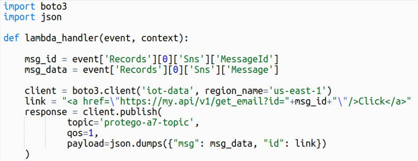

# S7:2017 Cross-Site Scripting (XSS)

## Attack Vectors

Cross-Site scripting (XSS) attacks target the browsers, which means that the attack vectors would be pretty much the same. The variation in serverless could come from the source of the stored attack. The source of traditional XSS attacks are usually databases or reflective inputs. While in serverless they could also originate from different sources like emails, cloud storage, logs, IoT and others.

## Security Weakness

XSS occurs when untrusted input is used to generate data that ends up in the DOM without performing proper escaping. For web services, it is typical to extract untrusted data from a JSON.

## Impact

Executing code on the user’s browser has the same impact we are used to. However, serverless by default is stateless, which means we are less likely to have regular session cookies which could lead to user impersonation. But that does not mean that sensitive data will not reside in the client like API keys stored in the browser local/session storage. Also, there is no change in attacks targeting the user’s privacy, like camera, speaker, location, etc.

## How to Prevent

This is one of the only risks for which original recommendations stand. Encoding all untrusted data before sending it to the client, as well as using known frameworks and headers are still valid in serverless.

## Example Attack Scenario

Used by support agents, an application alerts for any emails received via SNS. This is performed via a function that is triggered by an SNS event and pushes a notification to the operator dashboard.

The client that listens to the topic via MQTT-WebSocket, prints the email subject without performing any encoding/validation. This results in an XSS attack which originated by an email subject.

