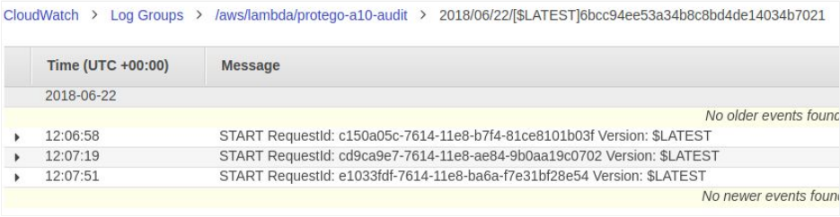

# S10:2017 Insufficient Logging and Monitoring

## Attack Vectors

Attackers rely on the lack of monitoring and timely response to achieve their goals without being detected, That's a known factor. The fact that serverless auditing is now even more difficult than in traditional applications, where we use our own logging system, and not the one provided by the infrastructure, just makes it easier for the attackers.

## Security Weakness

Applications which do not implement a proper auditing mechanism and rely solely on their service provider probably have insufficient means of security monitoring and auditing.

## Impact

The impact of not having a proper auditing mechanism in place cannot be determined by itself. But, the impact of identifying security incidents too late can be significant. An attacker may already be part of the application and infect the code. It is worth mentioning that the ephemeral nature of serverless functions makes exploits less sticky, which means that even if the application was infected, it might go away by itself, if the attacker is not using techniques to make the exploit last.

## How to Prevent

- Make use of the monitoring tools provided by the service provider (e.g. Azure Monitor, AWS CloudTrail) to identify and report unwanted behavior (e.g. wrong credentials, unauthorized access to resources, excessive execution of functions, unusually long execution time, and more.)
- Deploy an auditing and monitoring mechanism for data that is not fully reported by the infrastructure provider to identify security events.

## Example Attack Scenario

To tackle the missing perimeter, a serverless application has developed a lambda firewall which is triggered on every event and validates the incoming input against a file which contains a blacklist of inputs.

If the input is considered safe, the firewall calls the designated function that will process the request. However, if the input is considered malicious, the application logs the incoming input. A different function is reading the CloudWatch events and notifies in case a malicious input audit is found in the logs.

As a result of an input containing a malicious payload, the audit function printed a designated line into CloudWatch.

However, due to CloudWatch [log limits](https://docs.aws.amazon.com/AmazonCloudWatch/latest/logs/cloudwatch_limits_cwl.html), if an attacker will send a big input (over 1MB), the malicious input will not be detected and the function will not write any additional logs to CloudWatch, including the automatic END and REPORT logs. Instead, the logs will only show the START event entry.

