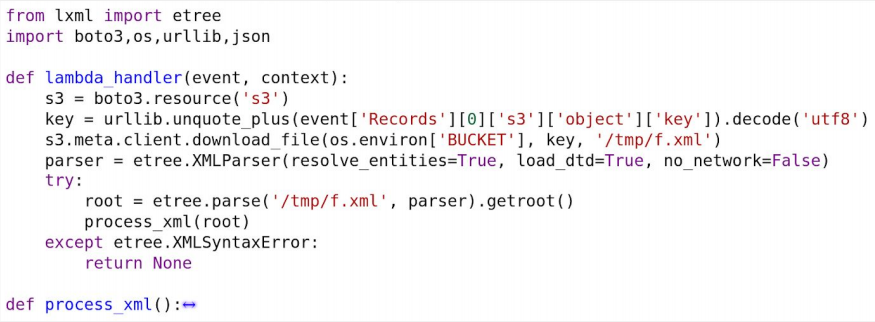
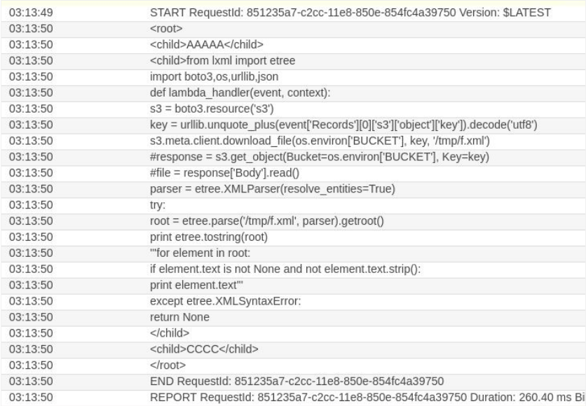

# A4:2017 XML External Entities (XXE)

## Attack Vectors

Successful exploits in monolithic applications can usually lead to extracting sensitive data, executing a remote request from the server, scanning internal systems, Denial of Service (DoS) and more.

In serverless, executing remote requests (OOB) might not be possible if the function is running inside the internal virtual private network (VPC). Scanning will be less likely to take effect in the few seconds the function has and DoS attacks are less of a concern, because the function is running in a designated container which will affect only the current execution.

## Security Weakness

Any use of XML processors might open the application to XXE attacks. By default, many older XML processors allow specification of an external entity, a URI that is dereferenced and evaluated during XML processing.

## Impact

A successful XXE attack in a serverless application could lead mostly into function code leak and other sensitive files that are located in the environment (e.g. environment variables, files under /tmp).

## How to Prevent

- Use the service provider’s SDK whenever possible
- Scan supply chain for relevant libraries known vulnerabilities
- If possible, identify and test for XXE attacks via API calls
- Make sure to disable Entity Resolution

## Example Attack Scenario

The attack vulnerability and payloads are the same as in traditional applications. A possible variation of the attack can be when a vulnerable function is triggered from a cloud storage upload event and parses files which contains XML content.



Sending a simple XXE payload caused the function to access its source code file:

```xml
    <!DOCTYPE foo [<!ELEMENT foo ANY >
    <!ENTITY bar SYSTEM "file:///var/task/handler.py" >]>
    <root>
        <child>AAAAA</child>
        <child>&bar;</child>
        <child>CCCC</child>
    </root>
```

As a result, the code was printed to the log. However, to leak the source out of the account, would require an Out-of-Bound or code execution XXE technique, that in many cases is disabled (like in this case) or irrelevant:

