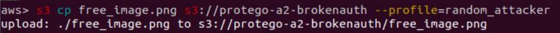

# A6:2017 Security Misconfiguration

## Attack Vectors

Unused pages are replaced with unlinked triggers, unprotected files and directories are changed to public resources, like public buckets. Attackers will try to identify misconfigured functions with long timeout or low concurrency limit in order to cause a Denial of Service (DoS). Additionally, functions which contain unprotected secrets like keys and token in the code or the environment could eventually result in sensitive information leakage.

## Security Weakness

Serverless reduces the need to to patch the environment, since we do not control the infrastructure. However, in many cases the biggest weakness is human error. Secrets could be [accidently uploaded to the github repo](https://www.forbes.com/sites/runasandvik/2014/01/14/attackers-scrape-github-for-cloud-service-credentials-hijack-account-to-mine-virtual-currency/), put it on a public bucket or even used hardcoded in the function.

Additionally, functions with long timeout configuration give an attacker the opportunity to make their exploit last longer or just cause an increased charge for the function execution.

Moreover, functions with low concurrency limit could lead into a DoS attack, while functions with high concurrency limit could result in a Denial of Wallet (see [Other Risks](0xab-other-risks.md) section)

## Impact

Misconfiguration could lead to sensitive information leakage, money loss, DoS or in severe cases, unauthorized access to cloud resources.

## How to Prevent

- Scan cloud accounts to identify public resources. Use built-in services available from the provider such as AWS Trusted Advisor which provides [security checks](https://aws.amazon.com/premiumsupport/trustedadvisor/best-practices/#security) (some for free).
- Review cloud resources and verify that they enforce access control.
- Follow providers security best practices: [How to secure AWS S3 Resources](https://aws.amazon.com/premiumsupport/knowledge-center/secure-s3-resources/), [Azure Storage security guide](https://docs.microsoft.com/en-us/azure/storage/common/storage-security-guide), [Best Practices for Google Cloud Storage](https://cloud.google.com/storage/docs/best-practices#security) and [IBM Data Security](https://www.ibm.com/cloud/garage/architectures/securityArchitecture/security-for-data).
- Check for functions with unlinked triggers. Look for resources that appear in their policy but are not linked back to the function.
- Set timeouts to the minimum required by the function.
- Follow the provider’s function configuration suggestions: [AWS configuring Lambda functions](https://docs.aws.amazon.com/lambda/latest/dg/resource-model.html), [Azure functions best practices](https://docs.microsoft.com/en-us/azure/azure-functions/functions-best-practices), [Google functions Tricks & Tips](https://cloud.google.com/functions/docs/bestpractices/tips).
- Use automatic tools that detect security misconfigurations in serverless applications.

## Example Attack Scenario

If the cloud storage is misconfigured and has public upload (write object) access, it allows users to directly upload files with their own account. If the upload event triggers an internal functionality, an attacker could use that to manipulate the application execution flow and bypass the original application flow.

For example, by running the aws-cli with his/her own profile credentials, the attacker is able to upload a random (invalidated) file into the organization’s cloud storage.

